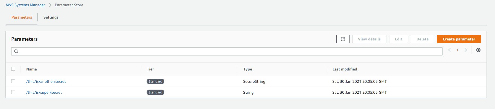

# ssm_mass_uploader

Upload multiple screts to AWS SSM Parameter store from single file

## Usage

### Example:

By Default the profile is 'default' and region is 'us-east-1'

```
example 1: python upload_ssm.py --r us-east-1 --p default
```

```
example 2: python upload_ssm.py
```

**example 1** and **example 2** do the same thing.

```
example 3: python upload_ssm.py --r us-west-1 --p some_other_profile_name_in_aws_credentials_file
```

---

## json to put in 'secrets_to_upload'

Note: Tags are not required, but if you do include them, then the key values are required

```json
{
  "Name": "String [REQUIRED]",
  "Description": "String [NOT REQUIRED]",
  "Value": "String [REQUIRED]",
  "Type": "String'|'StringList'|'SecureString [REQUIRED]",
  "KeyId": "String [NOT REQUIRED]",
  "Overwrite": "BOOLEAN [NOT REQUIRED]",
  "AllowedPattern": "String [NOT REQUIRED]",
  "Tags": [
    {
      "Key": "String [REQUIRED]",
      "Value": "String [REQUIRED]"
    }
  ],
  "Tier": "'Standard'|'Advanced'|'Intelligent-Tiering' [NOT REQUIRED]",
  "Policies": "String [NOT REQUIRED]",
  "DataType": "String [NOT REQUIRED]"
}
```

---

## Examples



### Basic Examples

```json
{
  "secrets": [
    {
      "Name": "/this/is/super/secret",
      "Value": "shhhh",
      "Type": "String"
    }
  ]
}
```

```json
{
  "secrets": [
    {
      "Name": "/this/is/super/secret",
      "Value": "shhhh",
      "Type": "SecureString"
    }
  ]
}
```

### Example with Tags

```json
{
  "secrets": [
    {
      "Name": "/this/is/super/secret",
      "Value": "shhhh",
      "Type": "String"
    },
    {
      "Name": "/this/is/another/secret",
      "Value": "hmmmm",
      "Type": "SecureString",
      "Tags": [
        {
          "Key": "Project Name",
          "Value": "Project X"
        }
      ]
    }
  ]
}
```

### Example allowing overwrites, secure string, and tags

Note: You cannot used Overwrite and tags in the same call. You should either add tags on first creation, or add / remove tags later on.

```json
{
  "secrets": [
    {
      "Name": "/this/is/super/secret",
      "Value": "new secret",
      "Type": "String",
      "Overwrite": true
    },
    {
      "Name": "/this/is/another/secret",
      "Value": "hmmmm",
      "Type": "SecureString",
      "Tags": [
        {
          "Key": "Project Name",
          "Value": "Project X"
        }
      ]
    }
  ]
}
```
